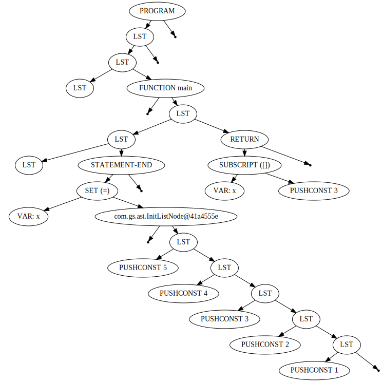

# GScript

GScript is my attempt at yet another scripting language. It started with obviously too ambitous goal of supporting static typing, which proved to be too much. This is still a goal, but not one that I hope to achieve in the nearest future.

GScript is implemented in Java because of the following reasons:

* it was meant for use on Android
* Java has reflection
* Java has garbage collector

# Building

## Requirements

* Java
* maven

Script in `bin/` directory are shell scripts, so at least the following tools are required:

* functioning bash
* functioning gawk

Script `gsdot` (and `gssvg` and `gsdot`, by transition) requires:

* functioning dot tool (so GraphViz)

## Compilation

GScript can be built using `maven` utility. To build everything, run:

```shell
mvn package
```

# Usage

Few example scripts are in directory:

```shell
progs/basic/
```

Not all of them work, as these scripts are used for (regression) testing.

## Running scripts

```shell
bin/gsr -f progs/basic/test0094.gs
```

## Dumping "assembly"

```shell
bin/gsda progs/basic/test0094.gs out.asm
```

NOTE: Adding .asm at the end of output file is not necessary, but VIM tries to highlight syntax and does pretty decend job.

Examplary program:

```gosu
def main() {
        def x = List[ 1, 2, 3, 4, 5 ];
        return x[3];
}
```

after decompilation yields:

```asm
.object.constant
        0 java.lang.Integer 1
.object.constant
        1 java.lang.Integer 2
.object.constant
        2 java.lang.Integer 3
.object.constant
        3 java.lang.Integer 4
.object.constant
        4 java.lang.Integer 5

.object.function main
// DBG: .file test
       0 PUSHCONST 0                         // DBG: 2,16-2,16
       2 PUSHCONST 1                         // DBG: 2,19-2,19
       4 PUSHCONST 2                         // DBG: 2,22-2,22
       6 PUSHCONST 3                         // DBG: 2,25-2,25
       8 PUSHCONST 4                         // DBG: 2,28-2,28
      10 MKLIST 5                            // DBG: 2,10-2,30
      12 GETVAR 0                            // DBG: 2,2-2,6
      14 SET                                 // DBG: 2,2-2,30
      15 POP                                 // DBG: 2,2-2,31
      16 GETVAR 0                            // DBG: 3,9-3,9
      18 PUSHCONST 2                         // DBG: 3,11-3,11
      20 SUBSCRIPT                           // DBG: 3,9-3,12
      21 END                                 // DBG: 3,2-3,13
      22 END                                 // DBG: 1,1-4,1

```

This is, unfortunately, one directional operation - there is no way to generate executable code from such output.

## Generating PNG or SVG files

There are three scripts that generate files with graphical AST representation:

`bin/gspng FILE`, which redirects to `bin/gsdot --type png --file FILE`

`bin/gssvg FILE`, which redirects to `bin/gsdot --type svg --file FILE`

Exemplary code used above yields the following graph in SVG format:



### gspng

```shell
bin/gspng progs/basic/test0094.gs
```

### gssvg

```shell
bin/gssvg progs/basic/test0094.gs
```

### gsdot

```shell
bin/gsdot --type png --file progs/basic/test0094.gs
```

# Features

Neater features of GScript include:

## Lambda with variables capturing

Capturing is done the way Java does it, that is captured variable keeps its value from the moment it was captured. This was initially done to perform "proper closures" (I think so),
that is if value in external scope is changed then lambda also observes this change.

Awkward example of lambda with capture is in [test0027.gs](progs/basic/test0027.gs). Another contrived example is in [test0032.gs](progs/basic/test0032.gs). Passing lambdas around is in [test0054.gs](progs/basic/test0054.gs).

## "Functions as first class citizens"

Functions can be assigned to variables and passed around. Example in [test0041.gs](progs/basic/test0041.gs).

## Constant folding

This is sometimes successful, for example in [test0024.gs](progs/basic/test0024.gs), and sometimes less so, for example in [test0025.gs](progs/basic/test0025.gs).

First example successfuly reduces whole expression to 0 constant, but second one fails to notice that x and y are, in fact, constants. I suppose that noticing it would be trivial if only SSA was used, but it isn't. For now.

## Range based `for` loops

For loops can operate on ranges, with syntax:

```gosu
for (x | iterable)
    ....
````

Example in [test0083.gs](progs/basic/test0083.gs). 

